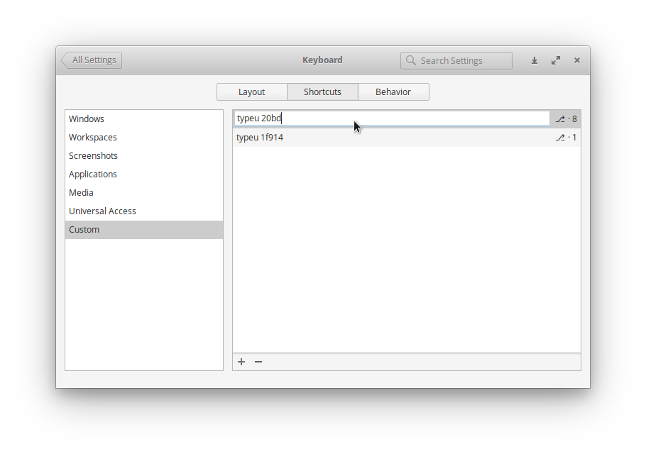

# typeu
A simple utility for creating unicode character shortcuts in elementaryOS / Ubuntu

## Installation
```
$ git clone https://github.com/kiraind/typeu
$ cd typeu
$ npm i
$ npm run deploy
```

## Usage
To type a unicode character use `$ typeu <code>`

```
$ typeu 20bd # -> ₽
```

So you can create a custom shortcut like **Alt + 8** to type any character including emoji



## Deinstallation
```
$ npm run uninstall
```
